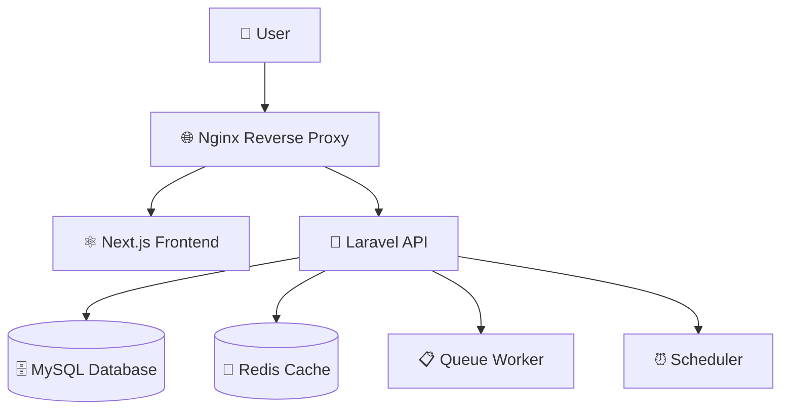

# 🚀 AI Tools Management System - Complete Docker Environment

## ✨ **ПЪЛНА DOCKER АРХИТЕКТУРА ОТ НУЛАТА**

### 🎯 **Архитектура на системата**



### 🐳 **Docker Services**

| Service | Container | Port | Description |
|---------|-----------|------|-------------|
| **Nginx** | `ai-tools-nginx` | 80, 443 | Reverse proxy & web server |
| **Laravel** | `ai-tools-laravel` | 9000 | PHP-FPM backend API |
| **Next.js** | `ai-tools-nextjs` | 3000 | React frontend application |
| **MySQL** | `ai-tools-mysql` | 3306 | Primary database |
| **Redis** | `ai-tools-redis` | 6379 | Cache & session store |
| **Queue** | `ai-tools-queue` | - | Background job processor |
| **Scheduler** | `ai-tools-scheduler` | - | Cron job manager |

### 🚀 **Бърз старт**

#### **Windows (препоръчително):**
```bash
# Стартиране на цялата система
start-dev.bat

# Спиране на системата  
stop-dev.bat
```

#### **Linux/macOS:**
```bash
# Стартиране
chmod +x start-dev.sh stop-dev.sh
./start-dev.sh

# Спиране
./stop-dev.sh
```

#### **Ръчно управление:**
```bash
# Изграждане и стартиране
docker-compose up -d --build

# Спиране  
docker-compose down

# Преглед на логове
docker-compose logs -f

# Рестартиране на конкретен сервис
docker-compose restart laravel-app
```

### 🌐 **URLs и достъп**

**🎯 Основни адреси:**
- **Frontend:** http://localhost:3000
- **API:** http://localhost/api  
- **Full App:** http://localhost
- **Admin:** http://localhost:3000/admin

**🏥 Health checks:**
- Frontend: http://localhost:3000/api/health
- Backend: http://localhost/api/health
- Nginx: http://localhost/health

**🗄️ Databases:**
- MySQL: `localhost:3306`
- Redis: `localhost:6379`

### 👥 **Демо потребители**

| Email | Role | Password |
|-------|------|----------|
| `owner@aitools.dev` | Owner | `password123` |
| `pm@aitools.dev` | Project Manager | `password123` |
| `backend@aitools.dev` | Backend Developer | `password123` |
| `frontend@aitools.dev` | Frontend Developer | `password123` |
| `qa@aitools.dev` | QA Engineer | `password123` |
| `designer@aitools.dev` | Designer | `password123` |

### 🛠️ **Development команди**

**🔧 Laravel (Backend):**
```bash
# Shell достъп
docker-compose exec laravel-app bash

# Artisan команди
docker-compose exec laravel-app php artisan migrate
docker-compose exec laravel-app php artisan db:seed
docker-compose exec laravel-app php artisan cache:clear

# Composer
docker-compose exec laravel-app composer install
docker-compose exec laravel-app composer update
```

**⚛️ Next.js (Frontend):**
```bash
# Shell достъп
docker-compose exec nextjs-app sh

# NPM команди
docker-compose exec nextjs-app npm install
docker-compose exec nextjs-app npm run build
docker-compose exec nextjs-app npm run test
```

**🗄️ Database операции:**
```bash
# MySQL shell
docker-compose exec mysql mysql -u laravel -p ai_tools

# Redis CLI
docker-compose exec redis redis-cli

# Database backup
docker-compose exec mysql mysqldump -u laravel -p ai_tools > backup.sql

# Database restore
docker-compose exec -T mysql mysql -u laravel -p ai_tools < backup.sql
```

### 📁 **Файлова структура**

```
ai-tools-fullstack/
├── 🐳 docker-compose.yml          # Main orchestration
├── 📄 .env.example                # Environment template
├── 🚀 start-dev.bat/.sh           # Development startup
├── 🛑 stop-dev.bat/.sh            # Development shutdown
│
├── backend/                       # Laravel API
│   ├── 🐳 Dockerfile              # Laravel container
│   ├── 📁 docker/                 # PHP, scripts config
│   ├── 📁 app/                    # Laravel application
│   └── 📄 .env                    # Laravel environment
│
├── frontend/                      # Next.js App
│   ├── 🐳 Dockerfile              # Next.js container
│   ├── 📁 app/                    # Next.js pages
│   ├── 📁 components/             # React components
│   └── 📄 .env.local              # Next.js environment
│
└── docker/                       # Infrastructure config
    ├── 📁 nginx/                  # Reverse proxy config
    ├── 📁 mysql/                  # Database config
    └── 📁 redis/                  # Cache config
```

### 🔧 **Конфигурации**

**🌐 Nginx Features:**
- ✅ Reverse proxy за Laravel/Next.js
- ✅ Load balancing
- ✅ SSL ready (certificates в `docker/nginx/ssl/`)
- ✅ Rate limiting
- ✅ CORS headers
- ✅ Static file serving
- ✅ Gzip compression
- ✅ Security headers

**🔧 Laravel Features:**
- ✅ PHP 8.2 + всички extension-и
- ✅ Composer dependency management
- ✅ Auto migrations & seeding
- ✅ Queue workers
- ✅ Cron scheduler
- ✅ Redis sessions
- ✅ File upload handling
- ✅ API rate limiting
- ✅ Health checks
- ✅ Xdebug за development

**⚛️ Next.js Features:**
- ✅ Node.js 18 + Alpine
- ✅ Hot reload в development
- ✅ Production optimizations
- ✅ API routes
- ✅ Static generation готовност
- ✅ Image optimization
- ✅ TypeScript ready

**🗄️ Database Features:**
- ✅ MySQL 8.0 с оптимизации
- ✅ Automated backups
- ✅ Performance monitoring
- ✅ Security logging
- ✅ Connection pooling

**🔴 Redis Features:**
- ✅ Memory optimization
- ✅ Persistence (AOF + RDB)
- ✅ Session management
- ✅ Queue processing
- ✅ Cache invalidation

### 🔐 **Security & Production**

**🛡️ Security Features:**
- ✅ Non-root containers
- ✅ Security headers
- ✅ Rate limiting
- ✅ CORS protection
- ✅ Input validation
- ✅ SQL injection protection
- ✅ XSS protection
- ✅ Audit logging

**🚀 Production Deployment:**
```bash
# Production build
docker-compose -f docker-compose.yml -f docker-compose.prod.yml up -d

# SSL certificates
# Add your certificates to docker/nginx/ssl/

# Environment variables
# Update .env files with production values

# Database migration
docker-compose exec laravel-app php artisan migrate --force

# Cache optimization
docker-compose exec laravel-app php artisan config:cache
docker-compose exec laravel-app php artisan route:cache
docker-compose exec laravel-app php artisan view:cache
```

### 📊 **Monitoring & Logs**

**📈 Health Monitoring:**
```bash
# Service health
curl http://localhost/health
curl http://localhost:3000/api/health

# Container status
docker-compose ps

# Resource usage
docker stats

# Service logs
docker-compose logs -f laravel-app
docker-compose logs -f nextjs-app
docker-compose logs -f nginx
```

**🔍 Debugging:**
```bash
# Laravel logs
docker-compose exec laravel-app tail -f storage/logs/laravel.log

# PHP errors
docker-compose logs laravel-app

# Nginx access logs
docker-compose exec nginx tail -f /var/log/nginx/access.log

# Database queries
docker-compose exec mysql tail -f /var/log/mysql/slow.log
```

### 💡 **AI Assistant Guidelines**

**🤖 Как AI може да помогне:**

1. **🐳 Docker troubleshooting:**
   - "Защо контейнерът не стартира?"
   - "Как да оптимизирам Docker build времето?"
   - "Обясни health check конфигурацията"

2. **🔧 Laravel enhancement:**
   - "Добави нов API endpoint"
   - "Създай migration за нова таблица"
   - "Обясни middleware за authentication"

3. **⚛️ Next.js development:**
   - "Създай нов React компонент"
   - "Добави API integration"
   - "Оптимизирай performance"

4. **🗄️ Database design:**
   - "Предложи schema за нова функция"
   - "Обясни indexing strategy"
   - "Създай complex query"

5. **🎨 UX/UI идеи:**
   - "Дизайн за dashboard"
   - "Role-based navigation"
   - "Responsive layout подобрения"

### 🎉 **Готова за Production система!**

✅ **Пълна Docker архитектура**  
✅ **Multi-stage builds за optimization**  
✅ **Health checks и monitoring**  
✅ **Security best practices**  
✅ **Development workflow**  
✅ **Production deployment ready**  
✅ **Comprehensive documentation**  

**🚀 Системата е готова за разработка и deployment!**